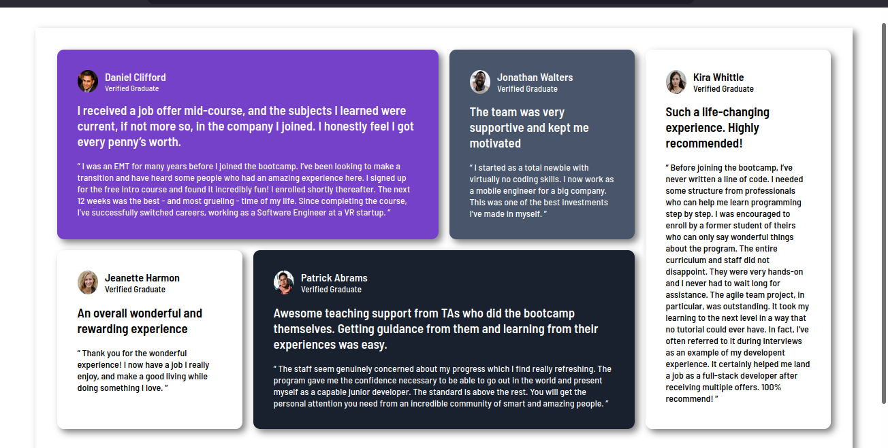

# Frontend Mentor - Testimonials grid section solution

This is a solution to the [Testimonials grid section challenge on Frontend Mentor](https://www.frontendmentor.io/challenges/testimonials-grid-section-Nnw6J7Un7). Frontend Mentor challenges help you improve your coding skills by building realistic projects. 

## Table of contents

- [Overview](#overview)
  - [The challenge](#the-challenge)
  - [Screenshot](#screenshot)
  - [Links](#links)
- [My process](#my-process)
  - [Built with](#built-with)
  - [What I learned](#what-i-learned)
  - [Continued development](#continued-development)
  - [Useful resources](#useful-resources)
  - [AI Collaboration](#ai-collaboration)
- [Author](#author)
- [Acknowledgments](#acknowledgments)

**Note: Delete this note and update the table of contents based on what sections you keep.**

## Overview

### The challenge

Users should be able to:

- View the optimal layout for the site depending on their device's screen size

### Screenshot

### Links

- Solution URL: [Git hub repo](https://github.com/kamogelo-29/testimonial-grid-sections)
- Live Site URL: [Add live site URL here](https://kamogelo-29.github.io/testimonial-grid-sections/)

## My process

### Built with

- Semantic HTML5 markup
- CSS custom properties
- Flexbox
- CSS Grid
- Mobile-first workflow

### What I learned

I learnt that I am still lacking on using display grid.
I tend to still use my old methods that allow me to have full control of the element when I design.
While at times grid can be a full tool set technology that allows me to control the element and how I want them to be displayed.

### Continued development

I need to practice to use grid for layouts and play around with grid.

### AI Collaboration

Describe how you used AI tools (if any) during this project. This helps demonstrate your ability to work effectively with AI assistants.

- Chatgpt
- I was debbuging my layout.
- WAll worked well

## Author

- Website - [Kamogelo](https://www.your-site.com)
- Frontend Mentor - [kamogelo-29](https://www.frontendmentor.io/profile/kamogelo-29)

